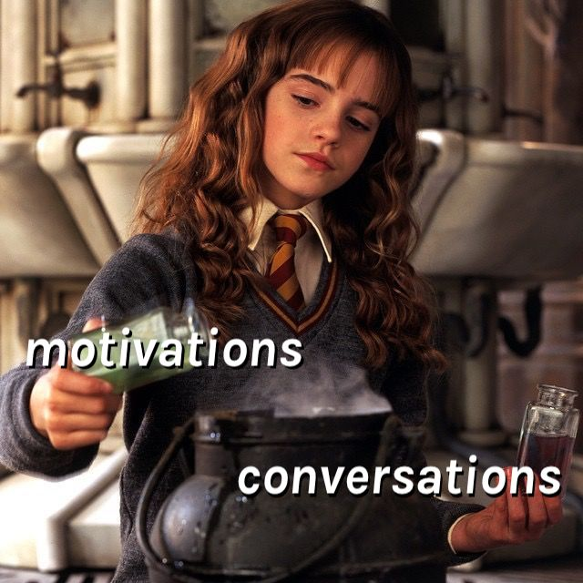

He dado unas [cuantas](https://www.youtube.com/watch?v=xsSnOQynTHs) [charlas](https://www.youtube.com/watch?v=nLF0n9SACd4) [técnicas](https://www.youtube.com/watch?v=dpw9EHDh2bM) que creo que fueron bien.

A veces la gente me pregunta cómo me preparo para una charla. Para cada orador, la respuesta es muy personal. Solo voy a compartir lo que funciona para mí.

**Este es el primer artículo de una serie** donde explico mi proceso de preparación para una carla técnica — desde la concepción de la idea hasta el día de la presentación:

* **Preparándose para una charla técnica, Parte 1: Motivación (*este artículo*)**
* **[Preparándose para una charla técnica, Parte 2: Qué, Por Qué y Cómo](/es/preparing-for-tech-talk-part-2-what-why-and-how/)**
* Continuará

---

**En este artículo, solo me enfocaré en el primer paso: por qué y cómo escojo un tema.** No es rico en consejos prácticos pero puede ayudarte a que te hagas las preguntas correctas.

---

¿Qué te motiva a *ti* a dar una charla?

Quizás dar charlas es parte de tu trabajo actual. Quizás quieres ganar más reconocimiento en la industria para conseguir un mejor empleo o un ascenso. Quizás estás ahí para atraer atención a tu hobby o proyecto de trabajo.

Llamaremos *externas* a estas motivaciones. Son acerca de lo que otras personas piensan de ti y de tu trabajo. Pero si ya tuvieses todo el respeto y dinero que quieras, ¿eligirías aún dar una charla? ¿Por qué?

Quizás te resulta gratificante enseñar a las personas. Quizás disfrutas aprender, y dar charlas es una linda excusa para ir más profundo. Quizás quieres iniciar o cambiar la conversación sobre algún tema. Quizás quieres amplificar o criticar una idea.

Tales motivaciones *internas* no son para canalizar otro deseo como el reconocimiento profesional. Estas son cosas que tienen valor intrínseco para ti. Diferentes personas son impulsadas por diferentes motivaciones internas. Es útil ser consciente de las tuyas. A veces se pueden rastrear hasta la infancia.

Por ejemplo, estas son las mías:

* **Disfruto compartir ideas que me inspiran.** A veces una idea transforma mi forma de pensar. Me abre puertas que no sabía que existían. Pero es solitario detrás de esas puertas. Quiero que otros se unan para que me enseñen puertas aún más interesantes dentro. Para mi, una charla es una forma de recolectar, curar y amplificar ideas que encuentro atractivas. (En mi adolescencia hacía compilados de canciones para mis intereses románticos que no tenían ningún interés en mi gusto musical. ¡Ahora doy charlas! La vida, em, encuentra la forma.)

* **Disfruto volver a explicar cosas en una forma más simple.** Cuando comprendo una idea, tengo una sensación muy agradable, mejor que comer dulces. Pero aprender no me es fácil. Así que cuando finalmente “comprendo” algo, quiero compartir esa sensación con la gente que aún está esforzándose. Intento recordar cómo era *antes* del momento *eureka* para ayudar a los demás “dar el salto” mientras miran mis charlas. (También era insufrible de niño porque insistía a todos que me hicieran preguntas. Una charla es una forma más productiva de canalizar esa energía.)

---

Combinar estas dos motivaciones internas me da la receta para una charla personalmente satisfactoria: **compartir una idea inspiradora al volver a explicarla en una forma más simple**.

---

Esa es mi fórmula. La tuya puede ser diferente, ¡piénsalo! ¿Qué charlas te hicieron sentir de una manera especial? ¿Cuáles son las similitudes estructurales entre ellas? (Discutiremos más sobre la estructura de las charlas en los siguientes artículos de esta serie.)

Dar una charla alineada con tus motivaciones es útil de muchas formas:

1. **Es más fácil escoger un tema.** Mi fórmula es “explica una idea inspiradora y por qué debería importarte”.  Puedo crear propuestas de charlas aplicando esta fórmula a cualquier concepto interesante que haya aprendido. Siempre tendré algo de qué hablar siempre que esté escuchando a gente inteligente con buenas ideas que merecen más exposición. Hay muchas otras fórmulas posibles — encuentra la tuya.

2. **Da menos miedo en el escenario.** Me aterrorizo 30 segundos antes de la charla pero *en el momento que empiezo a hablar, estoy en mi elemento*. El impulso de compartir una idea inspiradora supera el miedo de ser juzgado o de hacer algo mal. (Por supuesto, esto solo funciona con una buena preparación, lo cual discutiremos en los próximos artículos.)

3. **Es más convincente.** No puedo expresarlo [mejor que Sophie](https://mobile.twitter.com/sophiebits/status/1077723835481284608): Si te entusiasma un tema, puedes lograr que a la audiencia también le importe. El entusiasmo no significa necesariamente hablar fuerte o agitar las manos. Incluso con calma, la gente puede sentir cuando hay una convicción emocional detrás de una charla. (Esto también explica por qué podemos emocionarnos con una [canción](https://www.youtube.com/watch?v=6SWIwW9mg8s) incluso sin entender la letra.)

---

Hay una razón más por la que te ayuda cuando estás realmente entusiasmado con un tema. Sentir que eres parte de algo más grande hace maravillas en tu confianza.

Mis charlas no son sobre *mi*, son sobre una idea y yo solo soy el mensajero. Miles de personas en los livestreams y en la audiencia no están ahí realmente para juzgarme (incluso si creen eso). Vinieron a experimentar la idea que he traído para compartir. Mi rol es ser solo un conducto de una mente a otra. Muchos nervios y presiones de las charlas desaparecen luego de interiorizar esto.

---

Encontrar una formula consistente con tus motivaciones te ayuda a establecer tu propia voz. Pero ¿cómo encuentras un tema *específico* al cual aplicarla?

**En mi experiencia, las buenas charlas comienzan como una conversación.** Alguien me explica una idea y luego yo intento explicarla a alguien más. Le hablo sobre ella a una docena de personas y eventualmente encuentro explicaciones que hacen “click”. A veces hay un pensamiento que parece ignorado o incomprendido y trato de lograr que personas individuales lo vean con una luz diferente.

Para mi, una charla es solo una forma de generalizar esas conversaciones y hacerlas de uno a muchos en lugar de uno a uno. Es como una “librería” que extraes del "código de aplicación" de muchas conversaciones en persona y en las redes sociales.

Así que si quieres dar una charla, *hablar* con gente es una buena forma de empezar.

---

En este artículo he descrito el marco de referencia que me resulta útil para pensar en ideas para charlas. De nuevo, quiero enfatizar que solo estoy compartiendo lo que funciona para mi, hay muchos [tipos de charlas](https://mobile.twitter.com/jackiehluo/status/1077717283026411520) y tu mirada en esto puede ser muy diferente.

En los siguientes artículos de esta serie, hablaré sobre la preparación del bosquejo de la charla, las diapositivas, el ensayo de las charlas y lo que hago el día de la presentación.

**A continuación en esta serie: [Preparándose para una charla técnica, Parte 2: Qué, Por Qué y Cómo](/es/preparing-for-tech-talk-part-2-what-why-and-how/)**
