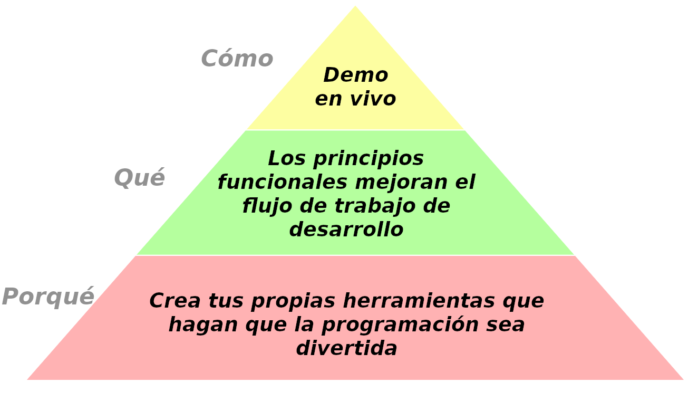
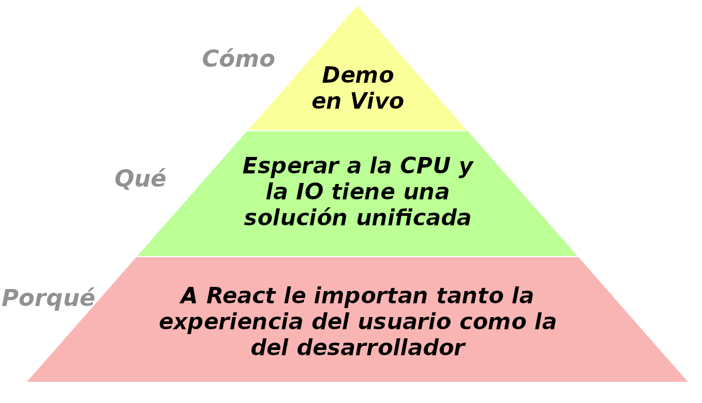
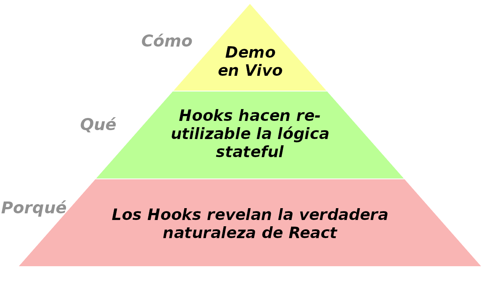

He dado unas [cuantas](https://www.youtube.com/watch?v=xsSnOQynTHs) [charlas](https://www.youtube.com/watch?v=nLF0n9SACd4) [técnicas](https://www.youtube.com/watch?v=dpw9EHDh2bM) que creo que fueron bien.

A veces la gente me pregunta cómo me preparo para una charla. Para cada orador, la respuesta es muy personal. Solo voy a compartir lo que funciona para mí.

**Este es el segundo artículo de una serie** donde explico mi proceso de preparación para una carla técnica — desde la concepción de la idea hasta el día de la presentación:

* **[Preparándose para una charla técnica, Parte 1: Motivación](/es/preparing-for-tech-talk-part-1-motivation/)**
* **Preparándose para una charla técnica, Parte 2: Qué, Porqué y Cómo (*este artículo*)**
* Continuará

---

**En este artículo me enfocaré en encontrar el Qué, el Porqué y el Cómo de mi charla.** Hacer esto con tiempo me ayuda a evitarme muchos dolores de cabeza luego.

---

Si no has visto [Inception](https://en.wikipedia.org/wiki/Inception), mírala hoy. Es un éxito de taquilla entretenido con visuales alucinantes y una trama estimulante. Pero cómo me ha enseñado [Ryan Florence](https://mobile.twitter.com/ryanflorence), también contiene buenos consejos para crear una charla memorable.

Esa película es acerca de poner ideas en las cabezas de otras personas mientras duermen. Esto puede sonar un poco invasivo (y es ilegal en la película). Pero si te alistaste para dar una charla técnica, es una descripción bastante precisa de lo que te enfrentas.

---

**¿Qué es lo más importante que quieres que la gente lleve de tu charla?** Trato de formularlo temprano en una oración. Esta idea no debería ser más larga que doce palabras. La gente olvidará la mayor parte de lo que dices así que necesitas escoger cuidadosamente *qué* quieres que persista. Es la semilla que quieres plantar en sus cabezas.

Por ejemplo, estas son las ideas principales de mis charlas:

* [Hot Reloading](https://www.youtube.com/watch?v=xsSnOQynTHs): “Los principios funcionales mejoran el flujo de trabajo de desarrollo.”

* [Más allá de React 16](https://www.youtube.com/watch?v=nLF0n9SACd4): “Esperar a la CPU y la IO tiene una solución unificada.”

* [Introducción a Hooks](https://www.youtube.com/watch?v=dpw9EHDh2bM): “Hooks hacen re-utilizable la lógica *stateful*”

No siempre *digo* explícitamente la idea central ni la escribo en una diapositiva, pero siempre es la espina dorsal intelectual de mi charla. Todo lo que digo y muestro debe finalmente trabajar en soportar esta idea. Quiero demostrártelo.

---

Una idea es el **“Qué”** de mi charla. Pero también están el **“Cómo”** y el **“Porqué”**:

El **“Cómo”** es mi método para entregar la idea a la audiencia. Personalmente prefiero los demos en vivo, pero hay muchas cosas que pueden funcionar. Hablaré más acerca del “Cómo” en un artículo futuro en esta serie.

Acabamos de hablar sobre el **“Qué”**, lo cual es la idea central de la charla. Es el pensamiento que quiero implantar en tu cabeza y la visión con la que quiero que te vayas. Es lo que quiero que la gente comparta con sus amigos y colegas.

Lo que nos trae al **“Porqué”**.

---

Para explicar el **“Porqué”** citaré este diálogo de la película Inception:

**(advertencia: spoilers!)**

>**Cobb:** "Dividiré el imperio de mi padre". Sin dudas esta es una idea que el propio Robert preferirá rechazar. Por eso tenemos que implantarla profundamente en su inconsciente. El inconsciente es motivado por los sentimientos, ¿cierto? No por la razón. Debemos hallar el modo de traducir esto en un concepto emocional.
>
>**Arthur:** ¿Cómo se traduce una estrategia comercial en un sentimiento?
>
>**Cobb:** Eso es lo que tenemos que averiguar, ¿entendido? La relación de Robert con su padre es tensa, como mínimo.
>
>**Eames:** ¿Podemos trabajar con eso? Podríamos sugerirle que disuelva la empresa de su padre como una forma de mandar al demonio al viejo.
>
>**Cobb:**  No, porque creo que las emociones positivas siempre triunfan sobre las negativas. Todos añoramos una reconciliación. Una catarsis. Tenemos que hacer que Robert Fischer tenga una reacción emocional positiva a esto.
>
>**Eames:** Bueno, intenta con esto. "Mi padre acepta que quiera crear por mi cuenta y no seguir sus pasos".
>
>**Cobb:** Podría funcionar.

No estoy sugiriendo que dividas imperios con tu charla.

Pero debe haber un [motivo](/es/preparing-for-tech-talk-part-1-motivation/) por el cual sales frente a miles de personas a hablar sobre algo. *Crees* en algo, y quieres que los otros compartan ese sentimiento. **Este es el "Porqué", el núcleo emocional de tu charla.**

---

Aquí hay ejemplos de los "Qué", "Porqué" y "Cómo" de mis charlas.

*(La pirámide anterior es para [Hot reloading con viaje en el tiempo](https://www.youtube.com/watch?v=xsSnOQynTHs))*

*(La pirámide anterior es para [Más allá de React 16](https://www.youtube.com/watch?v=nLF0n9SACd4))*

*(La pirámide anterior es para [Introducción a Hooks](https://www.youtube.com/watch?v=dpw9EHDh2bM))*

Una charla memorable toma una idea concisa, hace que a la audiencia le interese y tiene una ejecución clara y convincente. Ese es el “Qué”, “Porqué”, and “Cómo”.

---

En este artículo he descrito cómo organizo las ideas centrales de mis charlas. De nuevo, quiero enfatizar que solo estoy compartiendo lo que funciona para mi, hay muchos [tipos de charlas](https://mobile.twitter.com/jackiehluo/status/1077717283026411520) y tu mirada en esto puede ser muy diferente.

En los siguientes artículos de esta serie, hablaré sobre la preparación del bosquejo de la charla, las diapositivas, el ensayo de las charlas y lo que hago el día de la presentación.

**Anteriormente en esta serie: [Preparándose para una charla técnica, Parte 1: Motivación](/es/preparing-for-tech-talk-part-1-motivation/)**.
